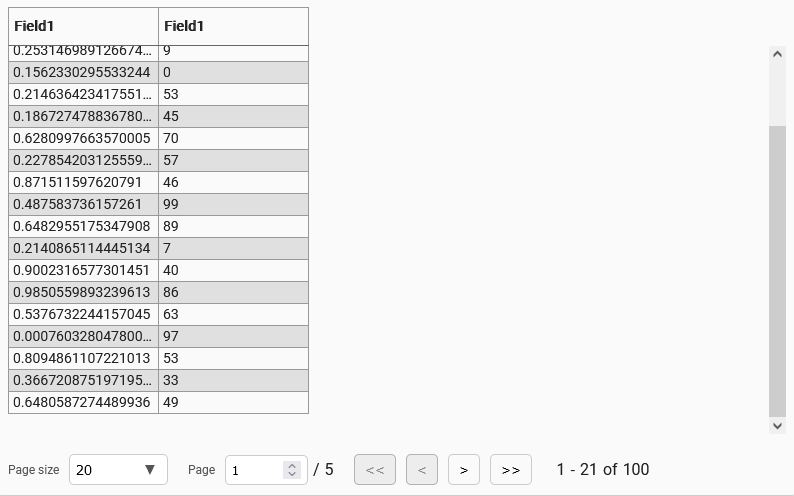

# ui-component-starter

A starter for creating a generic (no web framework) ui component in typescript, with a hot-reloading demo site.

## Setup

Throughout the starter, the component is called `MyComponent` as a placeholder. Execute `setup.sh` (e.g. `sh setup.sh`) to replace all occurences of `MyComponent` (and `my-component` in some places) with your desired component name.

## Usage

`npm i`

To start the component demo app: `npm start`

Edit a file within `src/component` to observe hot-reloading.

### TS
The typescript for the component should go into `src/component`

### Styles

Styles for the component should go into `src/component/styles`. The root style file is `index.scss`.

The styles are compiled and bundled with esbuild into `dist/styles.css` during the `npm run build-component` command.

There are two main ways the styles of the component can be imported into another project. One can either:

1. `import` the scss entrypoint or css bundle file into your .ts or .js file. This is supported by all the main bundlers out there like webpack and esbuild as long as you have the required loader/plugin for scss or css files configured.
    ```typescript
    // Import the scss entrypoint file from the src
    import 'node_modules/{your npm package name}/src/component/styles/index.scss'
    // Import the css bundle file
    import 'node_modules/{your npm package name}/dist/styles.css'
    ```
2. `@import` the scss entrypoint file into your scss file.
    ```scss
    @import '~{your npm package name}/src/component/styles/index.scss';
    ```

### Uploading Demo Images

It's useful to have an image of the component in the README that shows what it looks like. Place these images in the img directory. An image of the example component has been provided as an example:



## NPM Publishing

1. Ensure that `package.json` has the correct details for the npm package.
2. `npm run build-component`
3. `npm publish`

## Notable Technologies

* react
* esbuild
* typescript
* expressjs
* scss